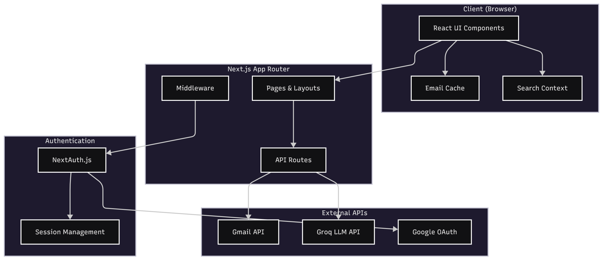
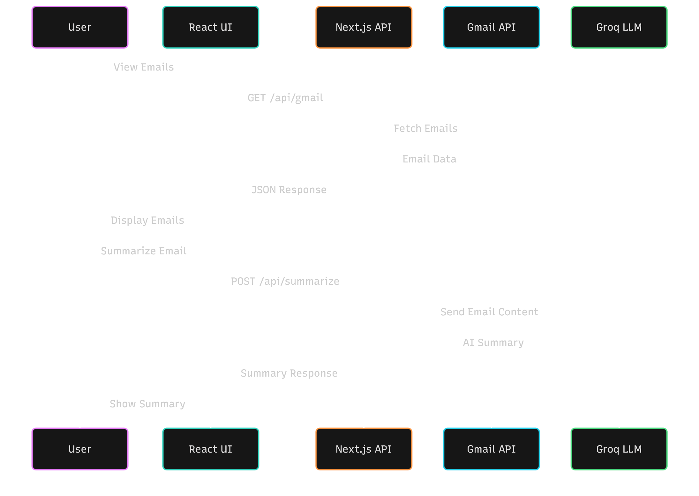

<div align="center">
  
  
  # MailMind
  
  **Your Gmail, Supercharged with AI Intelligence**
  
  [](https://nextjs.org/)
  [](https://react.dev/)
  [](https://tailwindcss.com/)
  [](LICENSE)
  
  [Demo](https://mailmind1.vercel.app) · [Report Bug](https://github.com/DaxModi/MailMind/issues) · [Request Feature](https://github.com/DaxModi/MailMind/issues)
  
</div>

---

## 🌟 Key Features Preview

<div align="center">
  <table>
    <tr>
      <td align="center" width="33%">
        
        <h3>🤖 AI-Powered Dashboard</h3>
        <p>Smart email analytics and AI summaries</p>
      </td>
      <td align="center" width="33%">
        
        <h3>✍️ Rich Email Composer</h3>
        <p>Advanced formatting and AI assistance</p>
      </td>
      <td align="center" width="33%">
        
        <h3>📱 Mobile Responsive</h3>
        <p>Seamless experience across devices</p>
      </td>
    </tr>
  </table>
</div>

---

## 📋 Table of Contents

- [About](#-about)
- [Features](#-features)
- [Tech Stack](#-tech-stack)
- [Architecture](#-architecture)
- [Getting Started](#-getting-started)
- [Environment Variables](#-environment-variables)
- [Project Structure](#-project-structure)
- [Screenshots](#-screenshots)
- [Roadmap](#-roadmap)
- [Contributing](#-contributing)
- [License](#-license)
- [Contact](#-contact)

---

## 🎯 About

MailMind is an AI-powered Gmail client that helps you manage your inbox more efficiently. It connects seamlessly to your Gmail account and uses advanced AI to summarize emails, highlight important information, and help you respond faster.

**Why MailMind?**
- 📧 **Overwhelming Inbox?** Get AI summaries of long emails in seconds
- ⏰ **Save Time** - Understand emails without reading walls of text
- 🔍 **Smart Search** - Find any email with intelligent context-aware search
- 🔒 **Privacy First** - Your emails stay private, we never store content

---

## ✨ Features

### Core Features
- **🤖 AI Email Summaries** - Get instant AI-generated summaries of long emails
- **📬 Full Gmail Integration** - Seamless connection via OAuth, all folders sync automatically
- **🔍 Smart Search** - Context-aware search with result highlighting
- **📊 Email Analytics** - Visual dashboard with email activity charts
- **⚡ Real-time Updates** - Fast, responsive UI with optimistic updates

### Email Management
- **📥 Inbox Organization** - View inbox, sent, drafts, archive, spam, and trash
- **✅ Bulk Actions** - Select multiple emails for batch operations
- **🏷️ Read/Unread Status** - Mark emails as read or unread
- **📎 Attachment Support** - View and manage email attachments
- **🗑️ Delete & Archive** - Quick actions on hover

### User Experience
- **🚀 Instant Loading** - Smart client-side caching for instant page loads
- **📱 Responsive Design** - Works beautifully on desktop and mobile
- **🌙 Dark Mode Ready** - Full dark mode support
- **⌨️ Keyboard Shortcuts** - Navigate efficiently with shortcuts

---

## 🛠️ Tech Stack

### Frontend
- **[Next.js 15](https://nextjs.org/)** - React framework with App Router
- **[React 19](https://react.dev/)** - UI library
- **[Tailwind CSS](https://tailwindcss.com/)** - Utility-first CSS
- **[shadcn/ui](https://ui.shadcn.com/)** - Beautiful UI components
- **[Framer Motion](https://www.framer.com/motion/)** - Animations
- **[Recharts](https://recharts.org/)** - Chart library
- **[Lexical](https://lexical.dev/)** - Rich text editor for composing emails

### Backend & APIs
- **[NextAuth.js](https://next-auth.js.org/)** - Authentication
- **[Google Gmail API](https://developers.google.com/gmail/api)** - Email operations
- **[LangChain](https://js.langchain.com/)** - AI orchestration
- **[Groq](https://groq.com/)** - Fast AI inference (Llama 3.3 70B)

### Icons & Assets
- **[Lucide Icons](https://lucide.dev/)** - Beautiful icons
- **[React Icons](https://react-icons.github.io/react-icons/)** - Icon library

---

## 🏗️ Architecture

### System Architecture

<div align="center">
  
  <p><em>High-level system architecture showing component interactions</em></p>
</div>

### Data Flow

<div align="center">
  
  <p><em>Data flow diagram showing how emails and AI requests are processed</em></p>
</div>

---

## 🚀 Getting Started

### Prerequisites

- Node.js 18+ 
- npm or yarn or pnpm
- Google Cloud Console project with Gmail API enabled
- Groq API key (for AI features)

### Installation

1. **Clone the repository**
   ```bash
   git clone https://github.com/DaxModi/MailMind.git
   cd MailMind
   ```

2. **Install dependencies**
   ```bash
   npm install
   # or
   yarn install
   # or
   pnpm install
   ```

3. **Set up environment variables**
   ```bash
   cp .env.example .env
   ```
   Fill in your environment variables (see [Environment Variables](#-environment-variables))

4. **Run the development server**
   ```bash
   npm run dev
   ```

5. **Open your browser**
   Navigate to [http://localhost:3000](http://localhost:3000)

---

## 🔐 Environment Variables

Create a `.env` file in the root directory with the following variables:

```env
# NextAuth
NEXTAUTH_URL=http://localhost:3000
NEXTAUTH_SECRET=your-nextauth-secret-here

# Google OAuth (Gmail API)
GOOGLE_CLIENT_ID=your-google-client-id
GOOGLE_CLIENT_SECRET=your-google-client-secret

# Groq AI (for email summaries)
GROQ_API_KEY=your-groq-api-key
```

### Getting API Keys

<details>
<summary><b>Google OAuth Setup</b></summary>

1. Go to [Google Cloud Console](https://console.cloud.google.com/)
2. Create a new project or select existing one
3. Enable the **Gmail API**
4. Go to **Credentials** → **Create Credentials** → **OAuth 2.0 Client IDs**
5. Set application type to **Web application**
6. Add authorized redirect URIs:
   - `http://localhost:3000/api/auth/callback/google` (development)
   - `https://yourdomain.com/api/auth/callback/google` (production)
7. Copy the Client ID and Client Secret

</details>

<details>
<summary><b>Groq API Key</b></summary>

1. Go to [Groq Console](https://console.groq.com/)
2. Sign up or log in
3. Navigate to **API Keys**
4. Create a new API key
5. Copy the key to your `.env` file

</details>

---

## 📁 Project Structure

```
MailMind/
├── public/                 # Static assets
│   ├── logo.png           # App logo
│   ├── icons/             # App icons
│   └── ...
├── src/
│   ├── app/               # Next.js App Router
│   │   ├── api/           # API routes
│   │   │   ├── auth/      # NextAuth endpoints
│   │   │   ├── gmail/     # Gmail API endpoints
│   │   │   └── summarize/ # AI summarization
│   │   ├── dashboard/     # Dashboard pages
│   │   │   ├── inbox/
│   │   │   ├── sent/
│   │   │   ├── drafts/
│   │   │   └── ...
│   │   ├── login/         # Login page
│   │   └── coming-soon/   # Coming soon page
│   ├── components/
│   │   ├── dashboardUI/   # Dashboard components
│   │   ├── emailUI/       # Email components
│   │   ├── home/          # Landing page components
│   │   ├── magicui/       # Magic UI components
│   │   ├── ui/            # shadcn/ui components
│   │   └── ...
│   ├── hooks/             # Custom React hooks
│   └── lib/               # Utilities and helpers
│       ├── ai/            # AI-related utilities
│       ├── emailCache.js  # Client-side caching
│       └── ...
├── .env.example           # Environment variables template
├── package.json
├── tailwind.config.js
└── README.md
```

---

## 📸 Screenshots

### 🖥️ Desktop Experience

<div align="center">
  
  <p><em>MailMind Dashboard - AI-powered email management with smart summaries and analytics</em></p>
</div>

<div align="center">
  
  <p><em>Email composition with AI assistance and rich formatting options</em></p>
</div>

### 📱 Mobile Responsive

<div align="center">
  
  <p><em>Fully responsive design - works seamlessly on mobile devices</em></p>
</div>

## 🤝 Contributing

Contributions are what make the open source community amazing! Any contributions you make are **greatly appreciated**.

1. Fork the Project
2. Create your Feature Branch (`git checkout -b feature/AmazingFeature`)
3. Commit your Changes (`git commit -m 'Add some AmazingFeature'`)
4. Push to the Branch (`git push origin feature/AmazingFeature`)
5. Open a Pull Request

### Development Guidelines

- Follow the existing code style
- Write meaningful commit messages
- Add tests for new features
- Update documentation as needed

---

## 📄 License & Privacy

Distributed under the MIT License. See `LICENSE` for more information.

**Important Links:**
- 📋 [Terms of Service](https://mailmind1.vercel.app/terms)
- 🔒 [Privacy Policy](https://mailmind1.vercel.app/privacy)

MailMind complies with Google's API Services User Data Policy, including Limited Use requirements. We never sell your data or use it for advertising.

---

## 📧 Contact

**Dax Modi** - [@DaxModi](https://github.com/DaxModi)

Project Link: [https://github.com/DaxModi/MailMind](https://github.com/DaxModi/MailMind)

---

<div align="center">
  
  **⭐ Star this repo if you find it helpful!**
  
  Made with ❤️ by [Dax Modi](https://github.com/DaxModi)
  
</div>
